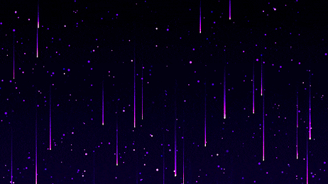

<link href="https://fonts.googleapis.com/css2?family=Tilt+Neon&display=swap" rel="stylesheet">

<h1 style="font-family: 'Tilt Neon', san-serif", align="center">✨ WELCOME TO MY PROFILE! ✨</h1>

    "Coding is not just about writing code, it's about creating solutions that matter. <b>Enjoy the Journey without end.</b>" 💻

  

## BIO

  👨‍💻 <b>Name</b>: Samuel Alvian Mahardika  
  🚹 <b>Gender</b>: Male  
  💼 <b>Role</b>: Software Engineer  
  🛠️ <b>Speciality</b>: Backend Engineer  
  📈 <b>Current Level</b>: Junior  
  🎯 <b>Current Activity</b>:  
  - 🌱 Upgrading skills and learning frontend skillsets  
  - 🏆 Team Leader RevoU FullStack Software Engineer - Section PARIS  
  - 🚀 Founder ELOLA - POS  

<h2 style="font-family: 'Tilt Neon', sans-serif;">
   Feel free to connect and explore my projects! 🚀✨
</h2>